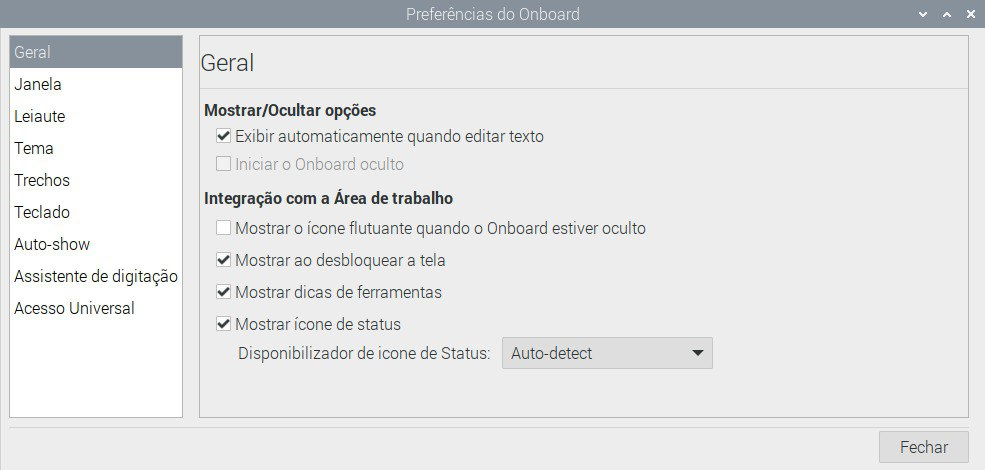
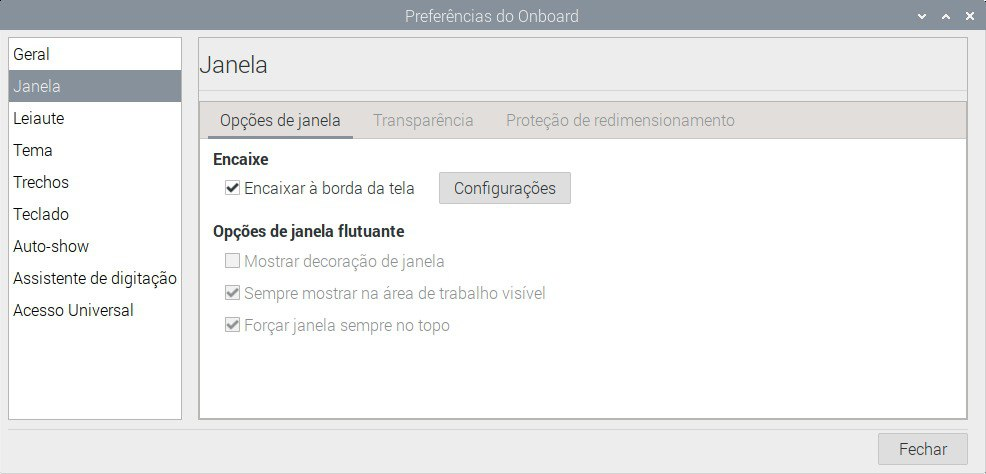
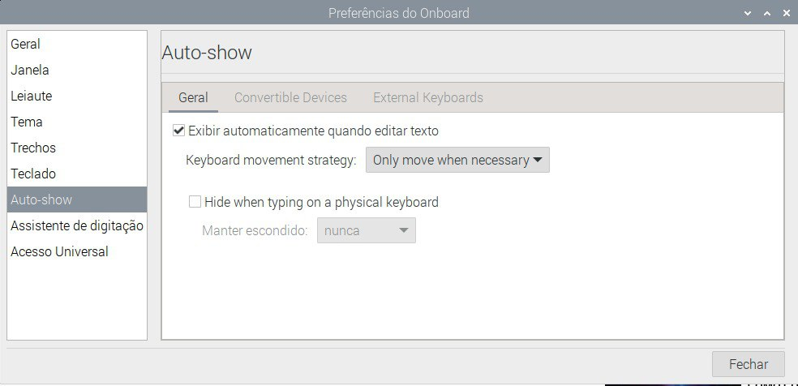
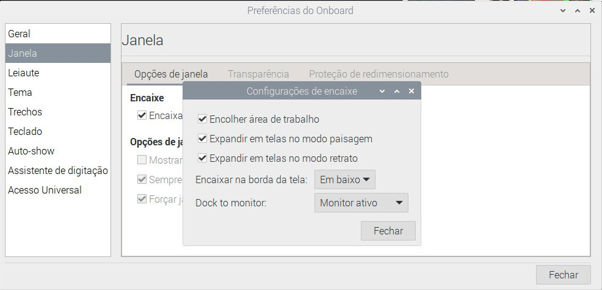

# backupCodigoTCC2

## Configurações Iniciais
Para rodar este código na raspberry pi 4 siga as etapas a seguir.

1. Acesse o site [documentation](https://www.raspberrypi.com/documentation/computers/getting-started.html).
2. Siga as intruções e baixe o sistema operacional em um cartão sd, utilizando o programa  Raspberry Pi Imager.
3. Instale o teclado virtual onboard
    1. sudo apt-get install onboard
    2. Talvez seja necessário executar
    ```sudo apt-get install at-spi2-core```
4. Clique no ícone da Raspberry Pi -> Acessabilidade -> Onboard
5. Configure o Onboard para ativar o teclado automaticamente ao clicar em um campo de texto.
    1. Clique nas 3 linhas no canto inferior direito
    2. Clique no ícone das ferramentas
    3. Acesse as configurações
    
    
    
    

6. (Opcional) Esconda o menu superior na raspberry pi
    1. Clique com o botão direito na barra de tarefas.
    2. Acesse configurações do painel -> Avançado
    3. Selecione a opção de minizar o painel quando não estiver em uso.

7. Instalação de bibliotecas para rodar o programa feito com o qtcreator
    1. ``sudo apt install qtbase5-dev qtchooser qt5-make qtbase5-dev-tools ``
        1. O qt5-make pode não ser encontrado, mas ainda consegui executar o código.
    2. ``sudo apt install qt5-doc qt5-doc-html qtbase5-doc-html  qtbase5-examples `` 
    3. ``sudo apt install qtcreator ``
    4. Instalação do módulo dos gráficos. ``sudo apt install libqt5charts5-dev``.

## Para rodar o código
Para rodar o código, é possível utilizar 2 opções:
1. Através do Makefile
    1. Acesse a pasta Code dentro deste projeto.
    2. Altere a variável ```isRaspberrypi``` para 0 se estiver em um computador normal e 1 para RaspberryPi.
    3. Execute o comando ``make`` no terminal para compilar os programas.
    4. Execute o comando `` make run -j 2 `` para rodar os 2 programas (da interface e da máquina) em paralelo.
    5. O programa deve iniciar corretamente, em caso de erro execute ``make clean``.

2. 
    1. Compile e execute a interface com o QtCreator
        1. Escolha o arquivo /Code/Interface.pro.
        2. Clique para buildar e depois executar o programa.
    2. Compile e execute o código da máquina
## Automatizaçãoes
Para facilitar a execução desse programa na Raspberry Pi, foram feitas
2 automatizações.
1. Início automático do teclado virtal Onboard ao ligar a Raspberry Pi.
    1. Execute no terminal ``sudo nano /usr/local/bin/keyboard.sh``
    2. Adicione o seguinte código abaixo
    ```
        #!/bin/bash
        sleep 5
        /usr/bin/onboard 
    ```
    3. Salve e saia.
    4. Execute ``sudo chmod +x /usr/local/bin/keyboard.sh`` para permitir a execução do script.
    5. Execute ``sudo nano /etc/xdg/lxsession/LXDE-pi/autostart``
    6. Adicione ao final do arquivo: `` @/usr/local/bin/keyboard.sh ``
    7. Agora a Raspberry Pi irá iniciar o teclado toda vez que realizar o boot.
2. Início automático do programa da máquina ao ligar a Raspberry Pi.
    1. Execute os comandos abaixo
    ```
    mkdir /home/pi/.config/autostart
    nano /home/pi/.config/autostart/machine.desktop
    ```
    2. Adicione o código abaixo
    ```
    [Desktop Entry]
    Type=Application
    Name=machine
    Exec= [caminho até o arquivo]/compile.sh
    ```
        Exemplo: Exec= /home/pi/Documents/backupCodigoTCC2/Code/compile.sh
    3. Agora a Raspberry Pi irá executar automaticamente o código ao realizar o boot.   


